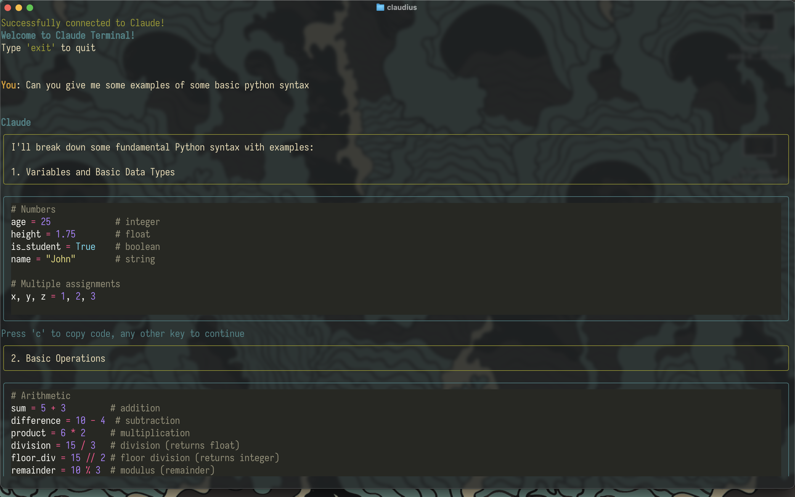

Super simple app coded in python. It's not perfect. I just wanted something simple. I tried several other apps but they never really worked the way I wanted them to. And they were always full of features I didn't want. Or they were full of bugs. And of the ones that worked, the interface was a little hard to see what was the prompt and what was the reply. I wanted something that would clearly deliniate between prompt and response a little better.

I am just learning to code and I've been using ai to ask all the questions I'm too embarrassed to ask. Or too dumb to find on Stack Overflow. There's a config file where you can change the initial prompt and which model to use. Along with some color options. Any block of code will give you the option to copy to your clipboard.



Download using...

```
git clone https://github.com/psillypsymun/Claudius_CLI.git
```

```

```

Store your API key in your shell. Open your .zshrc or .bashrc and add

```
export ANTHROPIC_API_KEY="YOUR_API_KEY"
```

Run the installation script:

```bash
./install.sh
```

You might need to run it with sudo if you don't have write permissions to /usr/local/bin:

```bash
sudo ./install.sh
```

After installation, you can:

- Run `claudius` from anywhere in your terminal
- Find your config at `~/.config/claudius/config.yaml`
- Find your virtual environment at `~/.claudius_env`

To uninstall:

```bash
rm -rf ~/.claudius_env ~/.config/claudius /usr/local/bin/claudius
```
